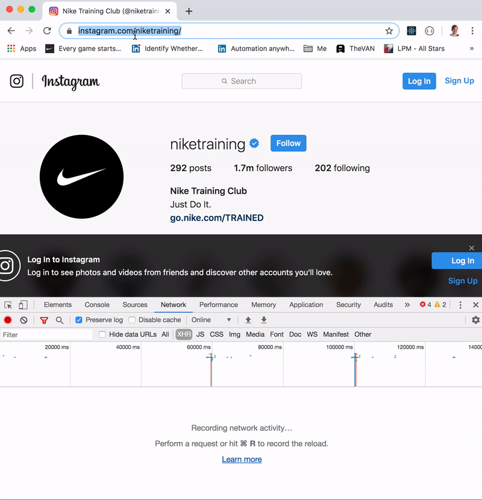

# csbsju-instagram-mining

## Prerequisites To Running this Script:
1) Must have access to a terminal on a machine with ability to install new software (admin privileges).
2) Must have NodeJS installed (https://nodejs.org/en/download/)
3) Must have NPM installed (https://www.npmjs.com/get-npm)

## Running this Script:
To run the script to scrap Instagram data, execute the following from a commandline in the directory where this project has been cloned to:
```
npm install
node index.js
```
# How it Works:
This project scraps the data from a single Instagram account and export the data into three csv files, located in the `data/` directory under a directory named with the date on which is was pulled. The files are `account`, `posts`, and `comments`. Post and Comment data can be joined via shortCode. Children comments can be joined to parent comment via parent_comment_id.

[Inspired By this Medium post](https://medium.com/@h4t0n/instagram-data-scraping-550c5f2fb6f1)

NOTE: Instagram rate limits (blocks additional successful calls being made) after a few hundred requests are made to their website. Because of this, it may take a while (hours/days) to fully scrape a particular account's data (especially if the account has a lot of posts or gets a lot of comments on their posts). To mitigate this, if you can find a way to change the IP address of the machine you are running this from (such as alternating between different VPN servers) you can make additional successful calls to Instagram's website (as they rate-limit based on IP address).

## To Further Explore the Data on Instagram
Inspect the JSON object at the URL below (open in your browser or using a tool such as cURL). Is there anything else you would like to added to the `account.csv` file?
```
https://www.instagram.com/niketraining/?__a=1
```

The script continues to loop the Posts found from the URL above, extracting each individual Post details.

To inspect further inspect the post details, inspect the JSON object at the URL below. Again, is there anything else you would like to added to the `posts.csv` file?
```
https://www.instagram.com/graphql/query/?query_hash=e769aa130647d2354c40ea6a439bfc08&variables=%7B%22id%22%3A%221415955173%22%2C%22first%22%3A12%2C%22after%22%3A%22QVFBMUNUN2c4NFA5UmM0VFI2LTlYUDFBUnA0RG9IaWpLNzBBNUxCaVZQLUVTN05IQ0FMVnhaVVhkaUJOMjFKMjJSaFJQVjQ0VkZFaE0wYnFjd0hyYUhuRQ%3D%3D%22%7D
```

The script will then continue to loop all of the comments found on each post, extracting information on each individual comment.

To further inspect the comment details, inspect the JSON object at the URL below. Again, is there anything else you would like to added to the `comments.csv` file?
```
https://www.instagram.com/graphql/query/?query_hash=bc3296d1ce80a24b1b6e40b1e72903f5&variables=%7B%22shortcode%22%3A%22B7_SLTFpkIj%22%2C%22first%22%3A13%2C%22after%22%3A%22QVFCZV85bWhnVnRCS3pmaXBKVnluS0ViSGozZm9rQ3lWZkZGcTBaNnQ2eVEtQXFYcmgwdUpRV1Y0RzBqOVc1ajA3NVFFeVcyMXZGVUdPUWpvcllHbWRDRA%3D%3D%22%7D
```

## Scraping Other Instagram Accounts
Update the `INSTAGRAM_ACCOUNT_NAME_TO_MINE` constant in index.js to desired account name. 

### Updating Query Hashes
It appears the query hashes stay constant between Instagram accounts. In case a hash needs to be updated, navigate to the Instagram account on your desktop in a web browser (without being logged in) and open the developer console and click the Network tab and then click the XHR filter button.

#### INSTAGRAM_QUERY_POST_HASH


#### INSTAGRAM_QUERY_TIMELINE_POST_HASH


#### INSTAGRAM_QUERY_COMMENT_HASH


#### INSTAGRAM_QUERY_CHILD_COMMENT_HASH
Find a comment with more than 3 replies. 

